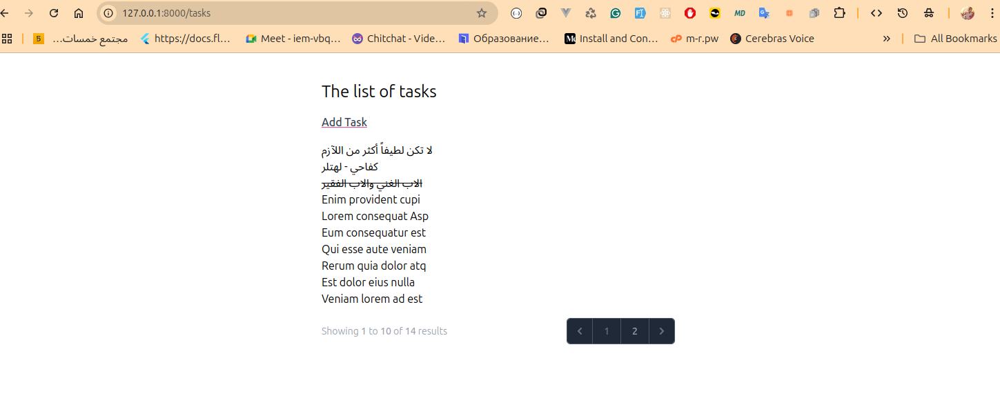
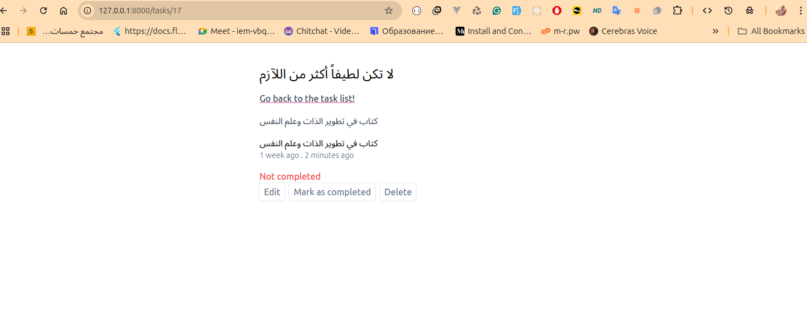
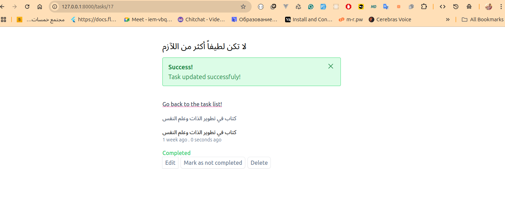
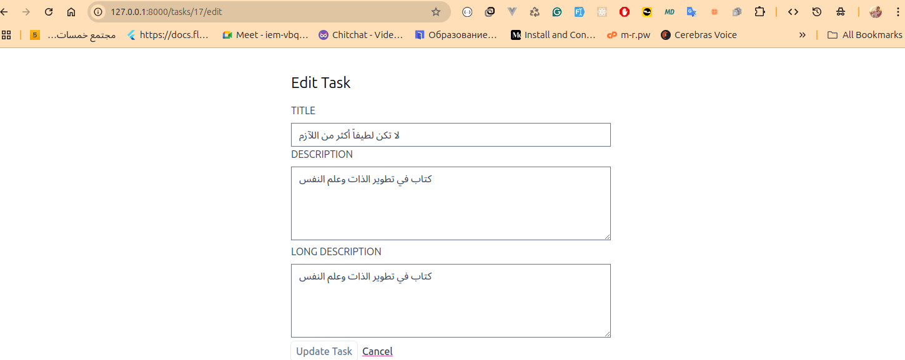
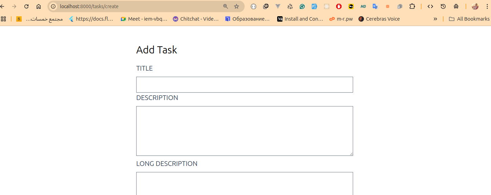

# Laravel Task List

A simple yet powerful task management application built with the Laravel framework. This project serves as a practical example of building a web application with Laravel, demonstrating core concepts like routing, controllers, models, views, and testing.

## 🚀 Features

- **CRUD Operations:** Create, Read, Update, and Delete tasks.
- **Task Completion:** Mark tasks as completed or not completed.
- **Validation:** Robust input validation to ensure data integrity.
- **Pagination:** Paginated task list for better performance and user experience.
- **RESTful API:** A clean and consistent set of API endpoints.
- **Comprehensive Test Suite:** A full feature test suite to ensure application reliability.

## 🛠️ Built With

- [Laravel](https://laravel.com/) - The PHP framework for web artisans.
- [Blade](https://laravel.com/docs/blade) - Laravel's powerful templating engine.
- [PHPUnit](https://phpunit.de/) - The standard for unit testing in PHP.
- [Tailwind CSS](https://tailwindcss.com/) - A utility-first CSS framework for rapid UI development.

## 📦 Installation

To get this project up and running on your local machine, follow these steps:

1.  **Clone the repository:**
    ```bash
    git clone https://github.com/kemo-byte/Laravel-livewire-task-list.git
    cd Laravel-livewire-task-list
    ```

2.  **Install dependencies:**
    ```bash
    composer install
    ```

3.  **Set up your environment:**
    ```bash
    cp .env.example .env
    ```
    Then, update the `DB_*` variables in your `.env` file with your database credentials.

4.  **Generate an application key:**
    ```bash
    php artisan key:generate
    ```

5.  **Run the database migrations:**
    ```bash
    php artisan migrate
    ```

6.  **Start the development server:**
    ```bash
    php artisan serve
    ```
    The application will be available at `http://127.0.0.1:8000`.

## 🧪 Running Tests

This project comes with a comprehensive test suite. To run the tests, execute the following command:

```bash
./vendor/bin/phpunit
```

## 🕹️ API Endpoints

The application exposes the following RESTful API endpoints for managing tasks:

| Method | URI | Name | Description |
| :--- | :--- | :--- | :--- |
| `GET` | `/tasks` | `tasks.index` | Display a list of all tasks. |
| `GET` | `/tasks/create` | `tasks.create` | Show the form for creating a new task. |
| `POST` | `/tasks` | `tasks.store` | Store a newly created task in the database. |
| `GET` | `/tasks/{task}` | `tasks.show` | Display the specified task. |
| `GET` | `/tasks/{task}/edit` | `tasks.edit` | Show the form for editing the specified task. |
| `PUT/PATCH` | `/tasks/{task}` | `tasks.update` | Update the specified task in the database. |
| `DELETE` | `/tasks/{task}` | `tasks.destroy` | Remove the specified task from the database. |
| `PUT` | `/tasks/{task}/toggle-complete` | `tasks.toggle-complete` | Toggle the completion status of a task. |

## 🖼️ Screenshots

Here are some screenshots of the application in action:


_The main task list view._


_The form for creating a new task._


_The detailed view of a single task._


_The form for editing an existing task._


_A task marked as completed._
